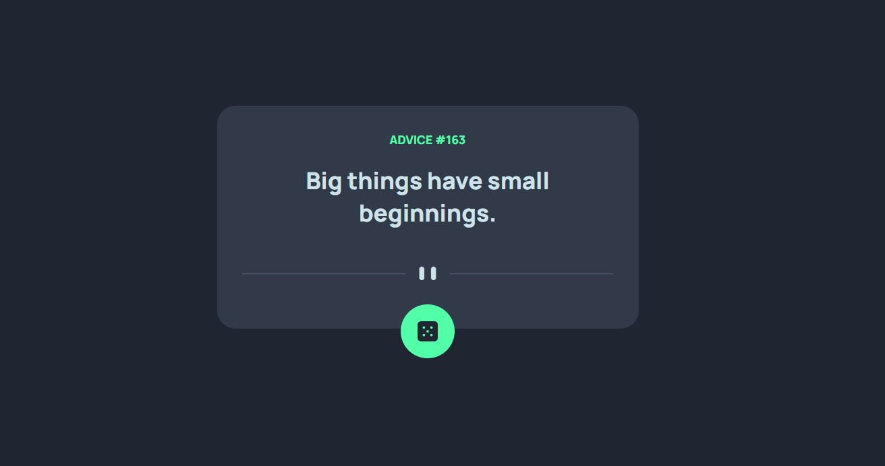

# Frontend Mentor - Advice generator app solution

Aqui é minha solução para o desafio [Advice generator app challenge on Frontend Mentor](https://www.frontendmentor.io/challenges/advice-generator-app-QdUG-13db).

## Table of contents

- [Overview](#overview)
  - [The challenge](#the-challenge)
  - [Screenshot](#screenshot)
  - [Links](#links)
- [My process](#my-process)
  - [Built with](#built-with)
  - [What I learned](#what-i-learned)
  - [Continued development](#continued-development)
  - [Useful resources](#useful-resources)
- [Author](#author)

## Overview

### The challenge


O desafio era criar um Advice app consumindo a API [Advice Slip API](https://api.adviceslip.com) e manter o visual o mais parecido possivel com o fornecido pelo frontend mentor.

Os usuarios devem ser capazes de:

- Ter a melhor visualização do conteudo para seus respectivos dispositivos
- Visualizar efeito de Hover ao interagir com elementos na tela (botão)
- Gerar um novo Advice sempre que clicar no botão.


### Screenshot



### Links

- Solution URL: [https://github.com/jumaelmartins/Frontend-Mentor-Advice-generator-app-solution](https://github.com/jumaelmartins/Frontend-Mentor-Advice-generator-app-solution)
- Live Site URL: [https://frontend-mentor-advice-generator-app-solution-jumaelmartins.vercel.app/](https://frontend-mentor-advice-generator-app-solution-jumaelmartins.vercel.app/)

## My process

### Built with

- Semantic HTML5 markup
- CSS custom properties
- SASS
- Flexbox
- JavaScript Vanila

### What I learned

Com esse projeto pude relembrar os conceitos de consumo de api e utilização de funções asyncronas no java script.
por em praticar tambem um pouco de manipulação do DOM, alem de continuar exercitando a escrita do html e estilização com CSS.


```js
const url = "https://api.adviceslip.com/advice";

export const getAdvice = async () => {
  try {
    const response = await fetch(url);
    if (!response.ok) {
      throw new Error(
        "Erro ao fazer requisição. Código de status: " + response.status
      );
    }
    const jsonBody = await response.json();
    const slip = jsonBody.slip;
    const advice = await slip;
    return advice;
  } catch (error) {
    console.error("Erro ao fazer requisição:", error);
  }
};
}
```
### Continued development

Pretendo continuar focando em aprimorar a utilização do SASS e criar mais projetos com consumo de api.

### Useful resources

- [ChatGPT](https://chat.openai.com/chat) - É uma ferramenta excellente tem me ajudado bastante a tirar duvidas.

## Author

- Portifolio - [Portifolio_JumaelMartins](https://portfolio-jumaelmartins.vercel.app/)
- Linkedin - [@jumael-martins](https://www.linkedin.com/in/jumael-martins/)
- GitHub - [@jumaelmartins](https://github.com/jumaelmartins)
- Frontend Mentor - [@jumaelmartins](https://www.frontendmentor.io/profile/jumaelmartins)

